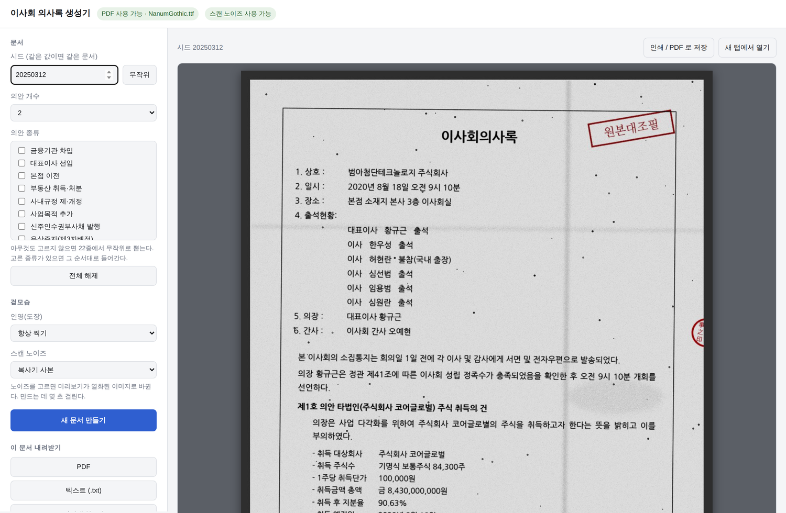
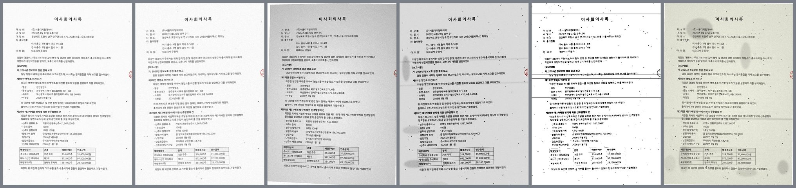

# minutes_generator

모의 이사회 의사록을 무작위로 생성한다. 문서 본문(텍스트)과 정답셋(JSON)을 같은 시드에서 함께 만들어 내므로,
OCR·문서 파싱 모델의 벤치마크 입력과 Ground Truth를 별도의 라벨링 없이 확보할 수 있다.

Python 3.9 이상. 텍스트·JSON·HTML 출력과 브라우저 UI 는 표준 라이브러리만으로 동작한다.
PDF 출력, 인영(도장) 이미지, 스캔 열화본에는 `reportlab`, `pillow`, `pypdfium2` 가 필요하며
실행 파일이 알아서 설치한다.

## 화면으로 쓰기

```bash
./run_ui.sh          # macOS, Linux
run_ui.bat           # Windows (더블클릭)
```



처음 실행하면 가상환경을 만들고 필요한 라이브러리를 설치한 뒤 브라우저를 연다.
왼쪽에서 시드와 의안 종류를 고르고 새 문서를 만들면 오른쪽에 실제 문서 모양으로 나온다.
인영을 항상 찍게 하거나 끌 수 있고, 스캔 노이즈를 고르면 미리보기가 열화된 이미지로 바뀐다.
PDF·텍스트·정답셋·스캔본을 한 건씩 내려받거나, 여러 건을 ZIP 으로 한꺼번에 받을 수 있다.

이미 파이썬 환경이 있다면 다음과 같이 바로 열어도 된다.

```bash
python3 -m minutes_generator --ui
```

## 명령행 사용법

```bash
# 한 건을 표준출력으로 (본문 + 정답셋)
python3 -m minutes_generator --seed 42

# 500건을 디렉터리에 저장
python3 -m minutes_generator --count 500 --seed 1000 --out ./out

# PDF 까지 포함해 전부 저장 (reportlab 필요)
python3 -m minutes_generator --count 100 --out ./out --format all

# 본문만, 의안 종류와 개수를 고정
python3 -m minutes_generator -n 20 -o ./out -f text --agenda borrowing,related_party

# 스캔 열화본까지 만들기
python3 -m minutes_generator -n 50 -o ./out -f all --scan random
python3 -m minutes_generator -n 50 -o ./out --scan mobile_photo --scan-format png

# 지원하는 의안 종류와 스캔 프로파일 확인
python3 -m minutes_generator --list-kinds
python3 -m minutes_generator --list-scan-profiles

# PDF 용 한글 글꼴을 찾을 수 있는지 확인
python3 -m minutes_generator --check-fonts
```

`--format` 은 `text`, `json`, `pdf`, `html`, `both`(text+json), `all` 중에서 고른다.

라이브러리로 쓸 때는 다음 한 줄이면 된다.

```python
from minutes_generator import sample

text, ground_truth = sample(seed=42)
```

같은 시드는 항상 같은 문서를 만든다. 시드를 생략하면 매번 달라진다.

## 무엇이 무작위로 채워지는가

문장 템플릿을 돌려쓰는 방식이 아니라, 회사·임원·의안의 값을 먼저 뽑고 그 값으로 문장을 구성한다.
1,000건을 생성했을 때 완전히 동일한 문서는 나오지 않으며, 상호 고유율은 약 86%, 인명 고유율은 약 95%다.

- **회사**: 상호, 본점 소재지, 액면가, 발행주식총수, 자본금, 발행예정주식총수, 사업목적
- **임원**: 이사 3~9명과 감사 0~2명, 사내·사외·기타비상무이사 구성, 직함, 한자 성명
- **회의**: 개최일시, 장소, 소집통지 방식 또는 소집절차 생략, 간사 지정 여부
- **출석**: 정족수를 만족하는 범위에서 불참자와 불참 사유, 화상회의 원격출석 (문서의 27%에 불참자가 생긴다)
- **의안**: 22종 중 1~6건, 종류별 가중치를 두어 실제 분포에 가깝게 뽑는다
- **표결**: 원안가결, 수정가결, 부결과 찬성·반대·기권 수
- **보고사항, 기타 토의사항, 첨부서류**: 확률적으로 등장

### 표기 스타일도 문서마다 달라진다

OCR 난이도를 좌우하는 표기 규칙을 문서 단위로 하나씩 뽑아 일관되게 적용한다.

| 축 | 변형 |
| --- | --- |
| 문체 | ~하다 / ~하였다 / ~하였음 |
| 날짜 | 2025년 3월 5일 / 2025. 3. 5. / 2025. 03. 05. / 二〇二五年 三月 五日 |
| 금액 | 3,000,000,000원 / 금 3,000,000,000원 / 금 삼십억원(￦3,000,000,000) |
| 의안 번호 | 제1호 의안 / 제1의안 / 1. |
| 출석 표기 | 가로 배치 요약 / 명단 나열 / 둘 다 |
| 날인 | (인) / (印) / (서명) |
| 상호 | 주식회사 / (주) / 株式會社 |
| 시각 | 오후 2시 30분 / 14:30 |
| 글꼴 | 고딕 계열 / 명조·바탕 계열 |
| 글자 크기 | 10 / 10.5 / 11 / 12 pt |
| 행간 | 1.45 ~ 1.8 배 |
| 정렬 | 양쪽 정렬 / 왼쪽 정렬 |
| 테두리 | 본문 외곽선 있음 / 없음 |

출석 현황의 가로 배치(`이사 총수: 5명     출석 이사 수: 5명`)는 읽기 순서를 위에서 아래로 왜곡하는 모델을
걸러 내기 위한 것이고, 한자 혼용과 금액 한글 병기는 문자 집합과 숫자 인식을 각각 압박한다.

## 인영(도장)

서명란의 성명 위에 붉은 인영이 겹쳐 찍힌다. 이름의 마지막 한 글자 정도를 가리므로,
가려진 글자를 읽어 내는지 확인할 수 있다. 이미지 자산 없이 코드로 그리며 문서마다 달라진다.

- **모양**: 원형, 사각, 모서리 둥근 사각
- **새김**: 성명 + 印, 성명만, 성명 + 之印, 대표이사는 代表理事之印 같은 직인
- **배치**: 전통 도장처럼 오른쪽 열부터 위에서 아래로 읽는 순서
- **질감**: 인주가 고르게 묻지 않은 얼룩, 기울기 ±14도, 찍힌 위치의 미세한 흔들림
- **간인**: 문서의 35%에 페이지 오른쪽 끝에 걸쳐 찍힌다
- **스탬프**: 22%에 사본, 원본대조필 같은 사각 스탬프가 비스듬히 들어간다

글꼴에 한자가 없으면 한글 인영으로 바꾼다. 나눔명조처럼 한자가 빠진 글꼴을 만나도
네모(두부) 글자가 찍히지 않는다. 본문 글꼴도 같은 방식으로 검사해서 고른다.

인영에 새긴 글자는 정답셋의 `signers[].seal` 에 그대로 실린다.

## 스캔 노이즈



깨끗한 PDF 를 이미지로 바꾼 뒤 현장 스캔본처럼 열화시킨다. 프로파일 일곱 가지가 있다.
위 그림은 왼쪽부터 `office_scan`, `low_dpi`, `mobile_photo`, `photocopy`, `fax`, `aged` 다.

| 프로파일 | 모사 대상 |
| --- | --- |
| `clean` | 깨끗한 원본 |
| `office_scan` | 사무실 복합기 300dpi 스캔 |
| `low_dpi` | 저해상도 스캔 (100~200dpi) |
| `mobile_photo` | 스마트폰 촬영. 원근 왜곡, 그늘, JPEG 압축 |
| `photocopy` | 복사기 사본. 얼룩, 접힘선, 스캐너 검은 테두리 |
| `fax` | 팩스. 흑백 2치화, 가로줄, 반점 |
| `aged` | 오래된 종이. 누런 색조, 뒷면 비침, 얼룩 |
| `random` | 위에서 `clean` 을 뺀 것 중 무작위 |

낱개 연산은 회전, 원근 왜곡, 흐림, 잡음, 해상도 저하, 그늘, 비네팅, 반점, 얼룩,
접힘선, 가로줄, 뒷면 비침, 종이 색조, 흑백 2치화, 명암·밝기, JPEG 압축, 스캐너 테두리다.

적용한 값은 정답셋의 `scan` 에 전부 기록된다. 조건별로 성능을 나눠 보려면 이 값으로 묶으면 된다.

```json
"scan": {"profile": "photocopy", "dpi": 200, "rotate": 0.404, "blotches": 4,
         "fold": 2, "blur": 0.428, "contrast": 1.411, "speckle": 236, "pages": 3}
```

같은 시드는 같은 이미지를 만든다. Pillow 의 잡음 생성기가 내부 난수를 쓰기 때문에
난수를 직접 만들어 재현성을 확보했다.

## 수치 정합성

무작위로 뽑되 문서 안의 숫자가 서로 맞도록 계산해서 채운다. 정답셋을 신뢰할 수 있어야 채점이 의미를 갖기 때문이다.

- 자본금 = 액면가 × 발행주식총수
- 신주 발행가액 총액 = 발행주식수 × 1주당 발행가액, 배정대상자별 주식수의 합 = 총 발행주식수
- 전환사채 전환가능주식수 = 권면총액 ÷ 전환가액, 만기보장수익률 ≥ 표면이자율
- 재무제표 자산총계 = 부채총계 + 자본총계
- 중간배당 총액 = 1주당 배당금 × 배당 대상 주식수
- 부동산 면적: 평 = ㎡ ÷ 3.305785
- 찬성 + 반대 + 기권 = 출석이사 수, 출석이사 수 ≥ 재적이사 과반수
- 상법 제398조 의안은 특별이해관계 이사를 의결에서 제외하고 재적이사 3분의 2 이상 찬성을 요구한다

`tests/test_minutes.py`가 400개 시드에 대해 위 항목을 모두 검증한다.

```bash
python3 -m unittest discover -s tests -t .
```

`tests/test_output.py` 는 HTML 구조, PDF 생성, UI 의 모든 응답 경로를 확인하고,
`tests/test_scan.py` 는 인영 배정과 열화 파이프라인의 재현성을 확인한다.
필요한 라이브러리나 글꼴이 없으면 해당 항목은 건너뛴다.

## 의안 종류 22종

유상증자(제3자배정), 전환사채 발행, 신주인수권부사채 발행, 대표이사 선임, 정기주주총회 소집,
임시주주총회 소집, 재무제표 승인, 지점 설치·이전·폐지, 본점 이전, 정관 변경, 금융기관 차입,
타법인 주식 취득, 부동산 취득·처분, 주식매수선택권 부여, 이사와 회사 간 거래 승인(상법 제398조),
사내규정 제·개정, 자기주식 취득, 중간배당, 지급보증, 사업목적 추가, 임원 보수 지급기준, 자회사 설립.

## 정답셋 구조

```
company     상호, 소재지, 액면가, 발행주식총수, 자본금, 사업목적
meeting     일시, 장소, 의장, 간사, 이사·감사 총수와 출석 수, 소집통지
directors   이름, 한자, 직위, 출석 여부, 출석 방식, 불참 사유
auditors    이름, 직위, 출석 여부
reports     보고사항 제목
agenda[]    index, kind, title, facts(의안별 핵심 수치), vote(찬반 내역과 결과)
signers     기명날인자와 인영에 새긴 글자
seals       인영 사용 여부, 간인, 스탬프
scan        스캔 열화본을 만든 경우 적용한 값 전부
style       해당 문서에 적용된 표기 규칙
```

`agenda[].facts`는 의안 종류마다 키가 다르다. 예를 들어 전환사채는 `face_value`, `coupon_rate`,
`conversion_price`, `convertible_shares`를 담는다. 키-값 추출(KIE) 채점은 이 딕셔너리를 그대로 쓰면 된다.

## 구조

```
minutes_generator/
  lexicon.py      인명·상호·주소·보고안건 등 어휘 풀
  names.py        인명, 상호, 주소 생성
  model.py        도메인 모델과 표기 스타일, 한글 수 표기
  agenda.py       의안 22종 생성기와 등장 가중치
  generator.py    회사·임원·회의체 구성과 표결
  render.py       의미 단위 흐름 생성, 텍스트 출력, 조사 교정, 정답셋 추출
  html_render.py  HTML 출력
  fonts.py        운영체제별 한글 글꼴 탐색과 글리프 확인
  pdf.py          PDF 출력 (reportlab)
  seal.py         인영·스탬프 이미지 생성 (pillow)
  scan.py         스캔 열화 파이프라인 (pillow + pypdfium2)
  imaging.py      재현 가능한 잡음 생성
  ui.py           브라우저 UI 서버
  cli.py          명령행 진입점
```

`render.build_flow` 가 제목·머리말·문단·표·서명란 같은 의미 단위 목록을 만들고,
텍스트·HTML·PDF 렌더러가 그 하나를 공유한다. 형식이 달라도 내용은 어긋나지 않는다.
출력 형식을 추가하려면 이 흐름을 소비하는 렌더러만 쓰면 된다.

## PDF 출력

`reportlab` 과 한글 글꼴이 있어야 한다.

```bash
pip install reportlab
```

글꼴은 운영체제 기본값을 자동으로 찾는다. Windows 는 맑은 고딕과 바탕, macOS 는 Apple SD Gothic Neo 와
AppleMyungjo, Linux 는 나눔고딕과 나눔명조를 먼저 본다. 찾지 못하면 환경변수로 지정한다.

```bash
export MINUTES_FONT_GOTHIC=/path/to/NanumGothic.ttf
export MINUTES_FONT_MYEONGJO=/path/to/NanumMyeongjo.ttf
```

Linux 에서 글꼴이 없다면 `sudo apt install fonts-nanum` 으로 설치하면 된다.
`--check-fonts` 가 현재 상태를 알려준다.

PDF 없이도 UI 에서 "인쇄 / PDF 로 저장" 을 누르면 브라우저의 인쇄 기능으로 PDF 를 만들 수 있다.
이 경로는 추가 설치가 필요 없다.

## 아직 없는 것

- 바운딩 박스 좌표. 렌더러가 좌표를 만들지 않으므로 레이아웃 검출 평가에는 쓸 수 없다.
  다만 본문이 의미 단위 흐름(`render.build_flow`)으로 만들어지므로, PDF 렌더러에서 좌표를 받아 적는 것은
  가능하다. 스캔 열화를 거치면 좌표도 같은 변환을 태워야 한다.
- 손글씨 서명. 인영은 그리지만 자필 서명 획은 그리지 않는다.
- 실제 인쇄 후 재스캔. 합성 노이즈가 실제 스캔본을 얼마나 대변하는지는 별도로 확인해야 한다.

## 라이선스

내부 벤치마크용. 생성되는 상호·인명·주소·금액은 모두 가공된 값이며 실재하는 법인이나 개인과 관계없다.
